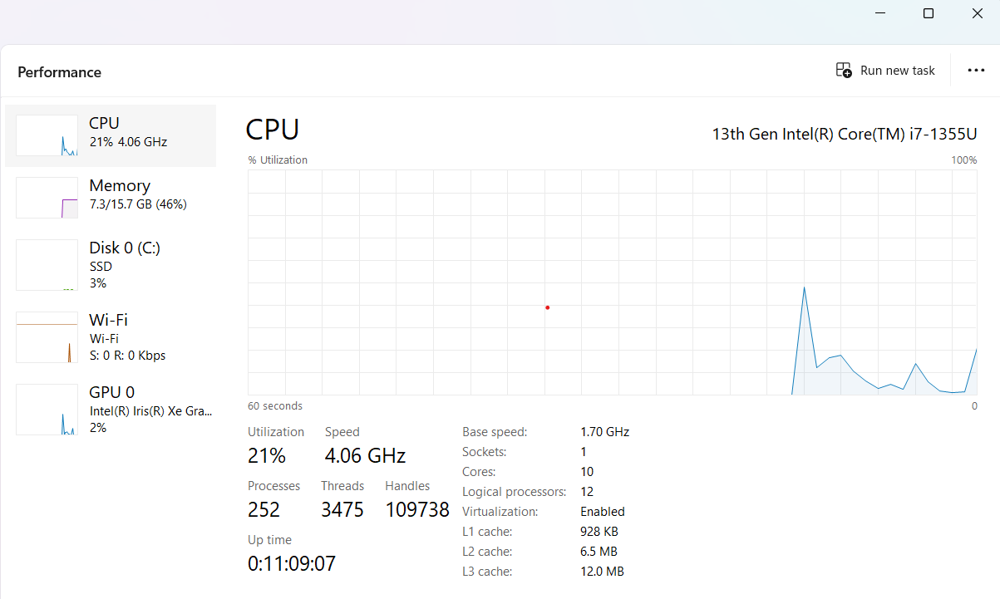

# Week 7-1: Introduction to Windows cmd

## Overiew

1. Use windows command prompt i.e. cmd to navigate and manage files and directories
2. Use wmic and explore task manager to manage processes and retrive system info
3. Create, manage and display user info using command line tool called net
4. Manage password policies and gpedit
5. Schedule tasks using Task scheduler

# Windows OS

- Windows is the leading desktop operating sytem.
- It provides AD (Active Directory).
- Windows is a very popular OS, with around 80% of usage around the world. Most of the govenrment institutions prefer to have windows machine.
- It a windows machine is unpatch or unsecure, it is easier for attakcers to target these matchines with malware.
- Linux has most publically know vulnerabilities (i.e. CVE's), but it is fairly secure OS. It can be use for anything from IOT devices to day-to-day use machine. Even a Windows machine can also run Linux VM.
- MAC machines are also vulnerability to attacks and can have malware attacks.
- Windows machines can be use for:
-- SOC analyst
-- Sysadmins
-- Pentesters
-- Forensics investigation

## Windows SYstem Administration

| Sysadmin task | Windows | Linux |
| -- | -- | -- |
| Audit processws with task manager || ps |
| gather info and create file |||
| Enforce password policy |||
| Manage users | ||
| Automate tasks | task manager | cron |

## 1. Leverage cmd to navigate and manage files and directories

- Windows is popular world wide
- Linux has known vulnerability
- Mac can also have virus, prefer to have anti-virus


## Start VM using Remote Desktop Protocol (RDP)

- Login into Azure
- It will have multiple containers, windows based or kali based.
- If the container is stopped, then start running that container.
- Click on a desktop to download rdp file, called Windows.rdp, which will be used to connect to the remote machine on the cloud.
- It will give the following pop-up to verify before connecting to the VM.


- Click continue
- Login into 
p4ssw0rd*

- Note: DO not upgrade or update any app on cloud VM.

- GO to Hyper V manager. It will have a list of machines that cloud machine can access.

-- Windows 10
-- Window server

## Task manager

- There are excessive number of processes that start up when you turn on Windows machine.
- It is important to maintain a Windows machine, otherwise there will be alot of unnecessary processes that will be running on that machine, resulting in slowing it down. Outdates apps exposes a machine to potential vulnerabilities and attacks.

```text
Task manager list down all the processes that are running on a machine. IT is a great tool to troubleshoot resource usage.
```

- It helps in identifying processes that are performing errant or malicious actions.

- It is similar to ps or top linux command in linux.

- provides textual as well as visual layout

### Audit processses with task manager

- Alarming if there are execessive # of processes or there are spikes in graphs. These procecsses can take up resources and allow unwanted connections.

-- Google chrome backgorund job is well known for its high usage of resources.
-- Teamaviewer is anotehr tool that makes a system extremely vulnerable.

- Blue screen of death (in older days) - with the message
- You PC ran into a problem that it couldn't handle and now it need to restart

### DEMO - Task Manager and Ending Processes

- Open task manager (Alt + Ctrl + del) or search by Taks manager


#### Processes - in alphabetical order

- List all the process in the following categories:

1. App - Apps that are launched by the user
2. Background processes - demons that are running in background. uch as Google chorme collect data in background.
3. Windows processes - processes for the operating system. These process are critical to OS and at times unable to terminate them.

For each process it displays:

- CPU consumption
- Memory - RAM usage
- Disk
- Network
- Power usage

By default, processes are listed in alphabetical order. You can also sort all the processes by CPU usage by double clikcing on CPU.

If a process is taking 80% or 100% of CPU - might be an issue. Either weak processor or a proces is taking up all the resources.

Processes, such as:

- Spotify
- TeamViewer - similar to rdp, but with alot of vulnerabilities.

##### Stop a process

- To top a process, right click on that process, such as TeamViewer and select 'End Task'


- It might be possible that this process is configured as start up process, that means if we loggout and log back in or reboot machine, then then this process will start running again. To make sure that the app does not start automatically again, go to start up tab and disable the app. Even after disabling appin start-up, you can run the app by launching it.

#### Performance



- CPU usage
- memory
- Disk
- Wifi or Eithernet - multiple internet connections (performance will have atleast 1 eithernet tab). THere could be eaitehrenet connection from virtual machines as well. 
Note: Look for spikes in all the graph to identify issues

#### Startup


- shows all the apps that start when computer starts
- There might be some applications like adobe, which collects your informaiton in the background.
- TO make a start up of a windows machine faster, disable apps that we dont want run when computer starts.
- A malware or a ransomware can be part of the start up process and run in the bacgorund.

## Windows structure

```text
C:\                         -> root directory
    |_ PerfLogs \           -> performance logs
    |_ ProgramFiles \       -> 64 bit apps
    |_ProgramFiles(x86) \   -> older - 32 bit apps
    |_ProgramData \         -> hidden folder - app specific data - The folder is hidden by default, to access this folder type C:\ProgramData
    |_Users \               -> all user home dir
        |_[username] \      -> Desktop of the speicifc user
            |_ Desktop \
            |_Documents \
    |_ Windows \            -> holds windows spcific program and library
        |_ System32 \
            |_Config \
            |_ Drivers \
                |_ etc \    -> similar to /etc in linux
                    |_ hosts
                    |_ network 
        |_ Spool
    |_Temp

```

### Environment Variables (envvar)

- variable are value holders that contain information about the system, such as current user s' home directory (%USERPROFILE%) or the system's program files directory (%ProgramFiles%)

- window is not case sensetive (%CD%, %cd%, %Cd% all same)

```text
%CD%                    Current directory
%DATE%                  Current date
%OS%                    Windows
%ProgramFiles%          C:\Program Files
%ProgramFiles(x86)%     C:\Program Files (x86)
%TIME%                  Current time
%USERPROFILE%           C:\Users\{username}
%SYSTEMDRIVE%           C:\
%SYSTEMROOT%            C:\Windows
```

## Introduction to terminal cmd

- Just like Linux terminal, Windows has its own terminal which run dos commands by default


### Windows cmd vs Linus cmd

| Windows| Linux | Description |
|----|----| ---|
|Not case-sensitive | Case sensetive ||
| tab to autocomplete | tab to autocomplete | |
| c: | cd / | go to system drive |
| ren | mv | Rename a file |
| copy | cp | Copying a file |
| move | mv | Moving a file |
| cls | clear | Clear Screen |
| del or erase| rm | Delete file | 
| fc | diff | Compare contents of files |
| find | grep | Search for a string in a file |
| command /? | man command | Display the manual/help details of the command |
| chdir | pwd | Returns your current directory location |
| time | date | Displays the time |
| cd | cd | Change the current directory |
| cd %USERPROFILE%\Desktop | cd ~/Desktop | Go to current user Desktop folder |
| > and >> | > and >> | Output to a file |
| echo | echo | To print something on the screen |
| echo %USERPROFILE% | | |
| echo Hello World > foo.txt -> Hello World | echo Hello World > foo.txt -> Hello World |
| echo "Hello World" > foo.txt -> "Hello World" | echo "Hello World" > foo.txt -> Hello World | Note: windows will output quotes to file |
| edit | vim(depends on editor) | To write in to files |
| format | mke2fs or mformat | To format a drive/partition |
| free | mem | To display free space |
| help dir | man ls | |
| dir | ls -l | Directory listing |
| md or mkdir | mkdir | To create a new directory/folder |
| rd or rmdir | rm -rf or rmdir | To delete a directory |
| taskkill | kill | To kill a task |
| tasklist | ps x | To list running tasks |
| set var=value | export var=value | To set environment variables |
| attrib | chown/chmod | To change file permissions |
| tracert | traceroute | To print the route packets trace to network host |
| at | cron | daemon to execute scheduled commands |
| type | cat | To print contents of a file|
| ping | ping | To send ICMP ECHO_REQUEST to network hosts |
| nslookup | nslookup | To query Internet name servers interactively |
| chdisk | du -s | For disk usage |
| tree | ls -R | To list directory recursively |
| exit | exit | To leave the terminal/command window |


### ACTIVITY

1. Using the Windows command line, create a `reports` folder on the user's desktop where you'll store your findings.

```command

C:\Users\sarat> mkdir reports
C:\Users\sarat> cd reports
C:\Users\sarat\reports>

```

2. Print a line that reads `Baselining Report` and output it to a new `report.txt` file. This will create a title within your report.

```command
C:\Users\sarat\reports> echo Baselining Report > report.txt
```

3. Print another line titled `Created by [your name here]` and append it to the file.

```command
C:\Users\sarat\reports> echo Created by Sara Tily >> report.txt
```

4. Use the ENV variables in the command line to add the OS, date, and user to the report using the command line.  Use the following format and refer to the reference table below: 

   - `[operating system] system report created on [today's date] with logged in user, [current username]`

```command

C:\Users\sarat\reports> echo %OS% system report created on %DATE% with logged in user, %username% >> report.txt
```
| Environment Variable | Default Value          |
| :------------------- | :--------------------- |
| `%CD%`                 | Current directory      |
| `%DATE%`               | Current date       |
| `%OS%`                 | Windows                |
|` %ProgramFiles%`     | `C:\Program Files`       |
| `%ProgramFiles(x86)%`  | `C:\Program Files (x86)` |
| `%TIME`                | Current time       |
| `%USERPROFILE%`        | `C:\Users\{username}`    |
|` %SYSTEMDRIVE%`        | `C:\`                    |
| `%SYSTEMROOT%`         |`C:\Windows`             |

#### Bonus

Using the ENV variables `%ProgramFiles%` and `%ProgramFiles(x86)%`, list the contents of these directories and append them to the report.

```command

C:\Users\sarat\reports> dir %ProgramFiles% >> report.txt
C:\Users\sarat\reports> dir %ProgramFiles(x86)% >> report.txt

```

## 2. Use wmic

- explore task manager to manage processes and retrive system info
- wmic - windows management instrumental cmd
- to launch, terminate and uninstall a program

```text
help wmic -> description about wmic

wmic [global switch] [alias] [verb] [properties]

global switch - optional e.g. /APPEND:report.txt

alias
    |_os
    |_ logicaldisk

properties (comma separated)
    |_ caption -> one line description
    |_ value -> all properties
```

### DEMO

- List all os 

``` wmic os get /value ```
``` wmic os get caption, buildnumber ```
``` wmic /APPEND:report.txt os get caption ```

```text
wmic logicaldisk get caption, filesystem, freespace, size, volumeserialnumber

Caption  FileSystem  FreeSpace     Size          VolumeSerialNumber
A:
C:       NTFS        233073475584  485724516352  F0E612E9
D:
```

```text
wmic /APPEND:report.txt logicaldisk get caption, filesystem, freespace
Caption  FileSystem  FreeSpace
A:
C:       NTFS        233073528832
D:
```

### ACTIVITIES

1. Using one command, append the following wmic query to your report.txt file as one output:

```text
>wmic /APPEND:report.txt os get caption, Version
Caption              Version
Microsoft Windows 8  6.2.9200

>wmic /APPEND:report.txt os get caption, buildnumber
BuildNumber  Caption
9200         Microsoft Windows 8
```

2. User account information (useraccount): Name, the security identifier of the user (sid), and description.

```text
>wmic /APPEND:report.txt useraccount get name, sid, description
Description                                               Name            SID

Built-in account for administering the computer/domain    Administrator   S-1-5-21-2296395624-447494839-3014060215-500
Built-in account for guest access to the computer/domain  Guest           S-1-5-21-2296395624-447494839-3014060215-501
Built-in account for homegroup access to the computer     HomeGroupUser$  S-1-5-21-2296395624-447494839-3014060215-1003
                                                          Sara            S-1-5-21-2296395624-447494839-3014060215-1001
```

3. Login information (netlogin): Username (caption), number of times user has logged on, and last logon time.

```text
>wmic /APPEND:report.txt netlogin get caption, Numberoflogons, lastlogon
Caption              LastLogon                  NumberOfLogons
NT AUTHORITY\SYSTEM
Sara                 **************.******+***  0
```

4. Windows Update information (qfe): Update name (caption), description, installed on date, and hotfix ID.

```text
>wmic  /APPEND:report.txt qfe get caption, description, installedon, hotfixID
```

## 3. Create, manage and display user info using net cmd

- print net options (help doesnot provide details about net cmd)
net /?

- for adding, removing and managing users
net users

- for adding, removing and managing groups on PC
net localgroup

- for viewing password policy
net accounts

### DEMO / ACTIVITY

create 2 users (Barbara - regular user, Andrew - admin user)

```text
- Add user
net user Barbara /add

- Delete user
net user Barbara /delete

- Add user with pwd
net user Barbara <password> /add

- To change the password of an existing user
net user [username] *

- Add user to administrations group
net localgroup Administrations Andrew /add

- List/Verify administrations group members
net localgroup Administrations
```

## 4. Manage password policies and gpedit

- group policy editor (gpedit)
- type gpedit in terminal, it will open UI to manage password policies
- there wil be two options for each setting, config and usage

```directories
Computer config
    |_ windows setting
        |_ security settings
            |_Account policies
                |_ Password policy
```

## 5. Schedule tasks using Task scheduler

Task Scheduler is a GUI tool that allows system administrators to automate the execution of scripts and applications on a Windows system.

### DEMO - Task Scheduling

Create scheduled tasks that will automate the reports.

- Just like cron job, Task scheduling can be used for:
-- Checking updates for endpoint security software
-- Sending logs to systems such as SIEM
-- Scheduling system maintenance scripts

### Activity - Task Scheduling

- Use Task Scheduler to schedule reports to be created every day.

1. Use the user, `azadmin`, to create a newly scheduled task.

2. Launch the Task Manager GUI application from the Start menu.


3. Create a new task.

4. Navigate to the scheduling section.

5. Schedule the task to execute every day.

- task is set to repeat daily with Recur every:[x] day set to 1, and the start date set to today. It should already be set, but you may have to input it manually.


6. Make sure the time is set to execute after a minute or two from your current time (so that we can make sure it executes properly).

    - Save your changes to the schedule.
